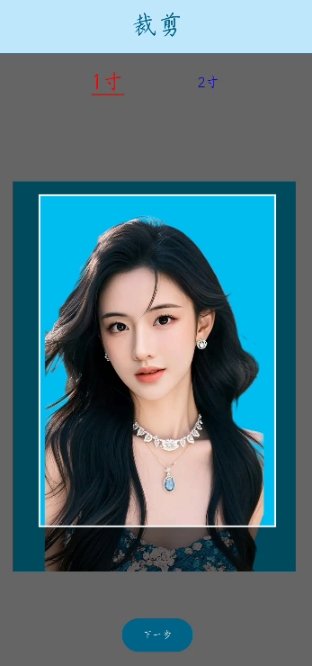

# IDPhotos 证件照App
# 一、写这个项目的原因 #

之前证件照都是去照片店拍，拍了后留一张电子版，再在电脑上进行换背景，用iSee排版，如果没有电脑的话，很不方便。

去换驾照的时候，由于事先并不知道需要自带一张白底照片，所以掏出手机，找了一大堆证件照App，好多都是收费的，并且App软件包很大，放了一堆SDK，个人信息容易泄露，于是乎花了三天时间，写了这个应用，又花了一天时间做了一些小改动和小修复。

# 二、功能 #

- 照片来源可以是相机拍摄，也可以是从相册选取。

- 抠图换背景，背景色可以是白色，蓝色，红色和保持不变。

- 照片尺寸裁剪，有一寸、二寸和驾照大小(仅白色可用，因为驾照要求白色背景)。
- 照片输出，有处理后的单张照片保存到相册，排版后的照片保存到相册和直接打印。
- - 排版支持3R/5寸，4R/6寸两种相纸。
  - 排版版式有多种，包括一二寸混合排版。

- 试卷打印，将两张A4竖版合成一张A4横版并打印。

# 三、项目使用 #

clone 本项目，修改证书配置，运行即可。因为用的是华为端侧服务(可以不用在AppGallery Connect上打开ML Kit打开服务开关)。

# 四、项目依赖 #

- Jetpack Compose

- Material3

- 华为机器学习-图片分割

- [Compose-Screenshot](https://github.com/SmartToolFactory/Compose-Screenshot)

  本项目在开发过程中也使用了Deepseek进行了辅助开发。

# 五、预览 #

|                           照片选择                           |                          抠图换背景                          |                             裁剪                             |
| :----------------------------------------------------------: | :----------------------------------------------------------: | :----------------------------------------------------------: |
|  |  |  |
|                             预览                             |                             预览                             |                             预览                             |
|  |  |  |

# 六、项目捐赠 #

如果你觉得此项目对你有帮助，可以捐助我，以鼓励项目能持续发展，更加完善

|                        Alipay 支付宝                         |                         Wechat 微信                          |
| :----------------------------------------------------------: | :----------------------------------------------------------: |
|  |  |

# Stargazers over time

